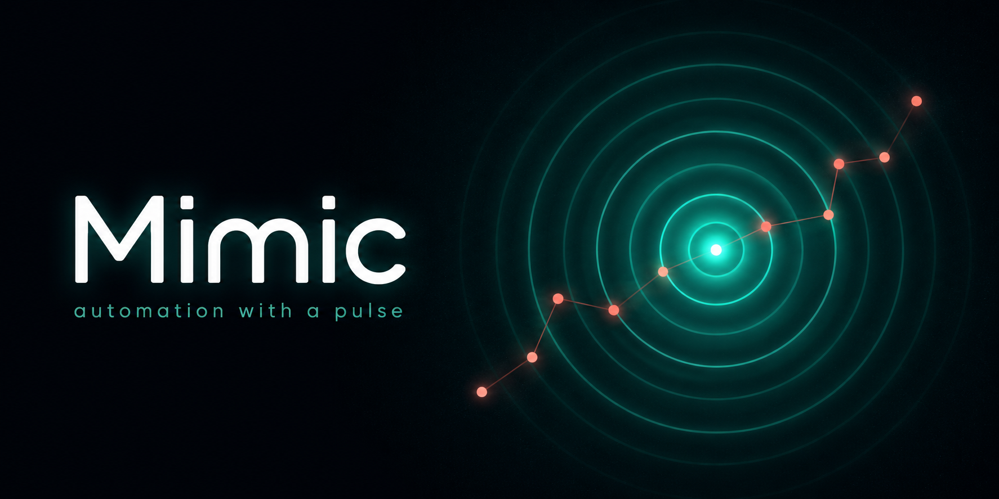
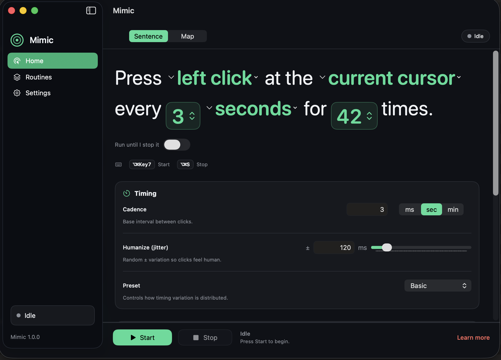
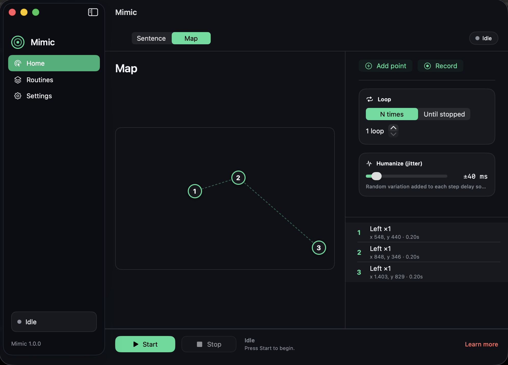
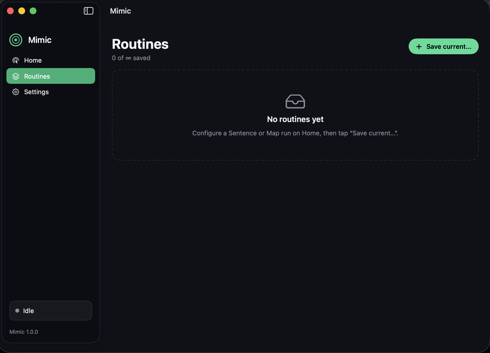
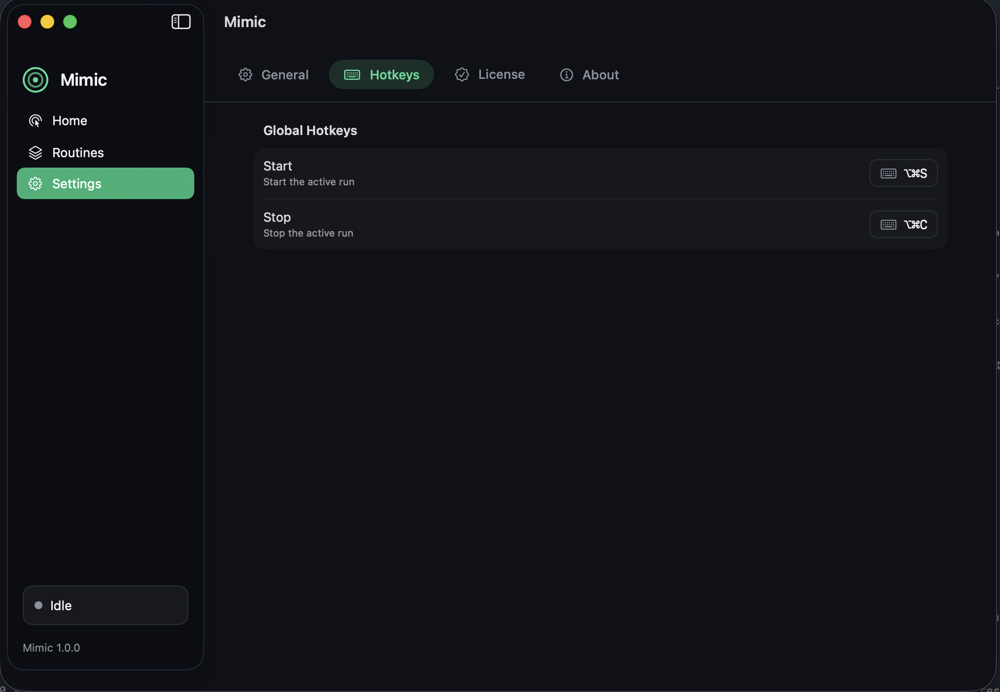
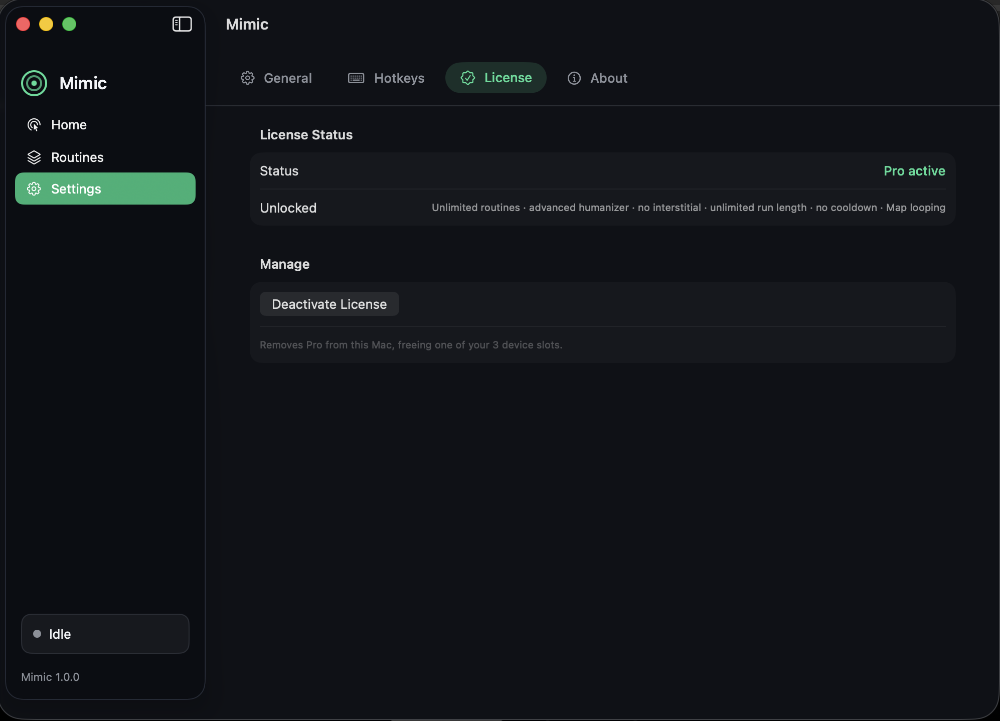
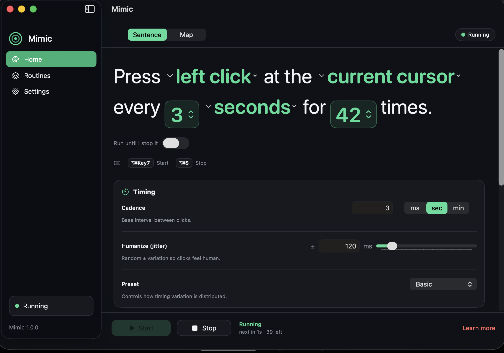
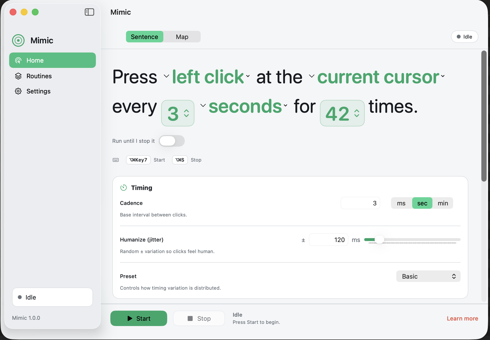

  

# Mimic

> [!NOTE]
> This is a **community hub**, not a source repository. It hosts Mimic's
> signed release downloads, translations, and issue tracker. The app's source
> code is closed and is never published here.

**Automation with a pulse — clicks that feel human.**

Mimic is a premium, minimalist macOS autoclicker and lightweight macro tool. Its
signature is that its clicks feel *human* — randomized timing ("jitter") instead
of robotic uniformity — and it runs both single-action ("Sentence") and
multi-point macro ("Map") sequences.

## Features

- **Humanized clicking** — interval jitter so clicks don't land on a robotic
  metronome. Free includes a fixed ±100 ms; **Pro** adds an adjustable amount
  and five distribution presets (Basic, Natural, Cautious, Aggressive, Burst).
- **Sentence mode** — a plain-English builder: *"Press **left click** at the
  **current cursor** every **3 seconds** for **42 times**."*
- **Map mode** — an ordered, looping sequence of click points on a visual canvas,
  with per-step delays.
- **Click or keypress** — repeat a mouse button, or (Pro) press a keyboard key
  each cycle.
- **Targets** — the current cursor (free), or a fixed screen point / the
  frontmost app (Pro).
- **Global hotkeys + Panic-stop** — separate Start/Stop shortcuts, a live
  menu-bar status item, and launch-at-login.
- **Developer-ID signed + notarized** — no Gatekeeper "unidentified developer"
  wall.

Free to download and fully functional. **Mimic Pro ($10 one-time)** removes the
usage interstitial and unlocks unlimited saved routines, the advanced humanizer,
unlimited run length, Map looping, and keyboard/non-cursor targets.

## Screenshots

|  |  |
|---|---|
|  |  |
| **Sentence mode** — build a run in plain English. | **Map mode** — sequence click points on a canvas. |
|  |  |
| **Routines** — save and reuse runs (unlimited with Pro). | **Hotkeys** — set global Start/Stop shortcuts. |
|  |  |
| **License** — activate Pro across up to 3 Macs. | **Running** — live countdown and status. |

More — light mode

| | |
|---|---|
|  | |
| **Light mode** — full light-appearance support. | |

## Download

Grab the latest signed `.zip` from the [Releases](https://github.com/beyondthecode-bc/Mimic/releases)
page. Each release ships a SHA-256 checksum and is notarized by Apple.

## Requirements

- macOS 14 (Sonoma) or later — Apple Silicon or Intel
- Accessibility permission (Mimic guides you through granting it on first launch)

## Get Mimic Pro

[Unlock Mimic Pro — $10 forever](https://beyondthecode.gumroad.com/l/mimic-pro).
Enter your license key in **Settings → License**. One purchase activates up to
**3 Macs**; deactivate any Mac to free a slot.

## Translations

Mimic is localized via XML files in [`languages/`](languages/). To contribute a
translation, copy `English.xml`, translate the values (keep the `key` attributes
unchanged), and open a pull request or a [Translation issue](https://github.com/beyondthecode-bc/Mimic/issues/new?template=translation.md).

## Support

- [Report a bug](https://github.com/beyondthecode-bc/Mimic/issues/new?template=bug_report.md)
- [Request a feature](https://github.com/beyondthecode-bc/Mimic/issues/new?template=feature_request.md)
- Homepage: https://beyondthecode.app

---

Made by [Beyond the Code](https://beyondthecode.app).
